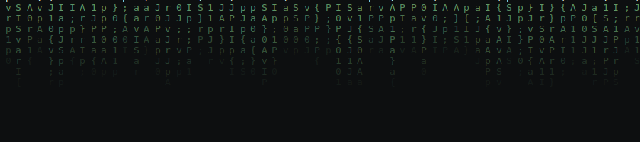
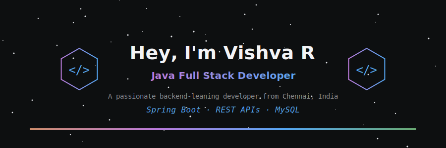
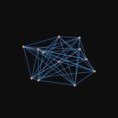

  

  

# Hi, I'm Vishva 👋

I am a **Java Full Stack Developer** with a passion for building robust, secure, and scalable enterprise applications. I specialize in backend architecture and have successfully integrated AI solutions to optimize real-world workflows.

---

## 💼 Professional Experience & Internships

* **JPMorgan Chase & Co. | Software Engineering Virtual Internship (June 2026)**
  * Engineered backend modules covering project setup, Kafka event-driven integration, H2 database integration, and REST API controller design.
* **Walmart Global Tech | Advanced Software Engineering Virtual Internship (July 2026)**
  * Applied advanced concepts in data structures, software architecture, relational database design, and data munging.

---

## 🛠 Technical Expertise

* **Core Languages:** Java (Advanced), SQL (Advanced), HTML/CSS (Advanced)
* **Frameworks & Architecture:** Spring Boot, Spring Security, Hibernate, Thymeleaf
* **API & Data:** RESTful APIs, JWT Authentication, MySQL, H2 Database, Apache Kafka
* **DevOps & Tooling:** Git, GitHub, Maven, Render, Aiven, Docker, Postman, IntelliJ IDEA

---

## 🚀 Key Projects & Impact

| Project | Key Technologies | Business Impact |
| :--- | :--- | :--- |
| **MediCare System** | Java, Spring Boot, Claude AI, MySQL | Digitized registration/scheduling, cutting manual admin work by ~50%. |
| **Car Care System** | Java, Spring Boot, Spring Security, MySQL | Optimized booking/sales workflows, cutting manual effort by ~60%. |
| **E-Commerce API** | Spring Boot, JWT, MySQL | Centralized inventory management, boosting API security by ~65%. |

---

## 🎓 Education & Certifications

* **M.Sc. Information Technology** | Dhanraj Baid Jain College (2026–2028, Pursuing)
* **B.Com. Computer Applications** | Asan Memorial College of Arts & Science (2022–2025)
* **Java Full Stack Development** | Uniq Technologies (360-Hour Certification, 2025–2026)

---

  

---

## 📈 GitHub Metrics

  
  

---

  

## 📫 Connect with Me

  
  
  

  

