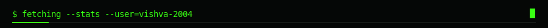
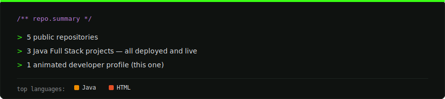

 

 

## About Me

 

## Connect with Me

 

## Tech Stack

 

## GitHub Stats

 

 

 

  

 

## Featured Projects

[MediCare — Smart Healthcare System](https://github.com/vishva-2004/MediCare-Smart-Healthcare-System) &nbsp;·&nbsp;
[Vehicle Showroom Management System](https://github.com/vishva-2004/car-care-management-system) &nbsp;·&nbsp;
[Spring Boot E-Commerce REST API](https://github.com/vishva-2004/springboot-ecommerce-api)

 

