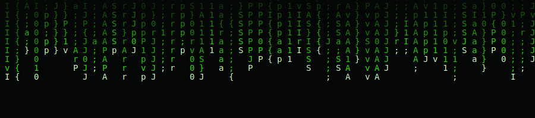
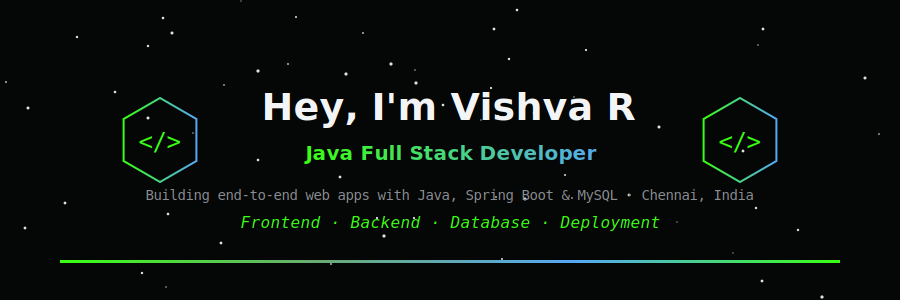
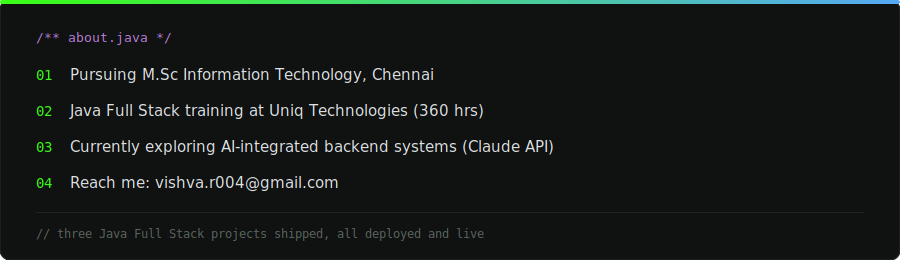
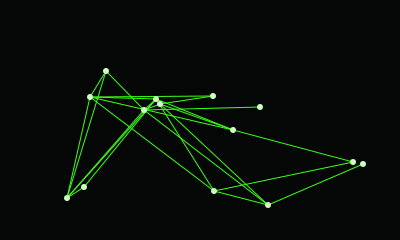
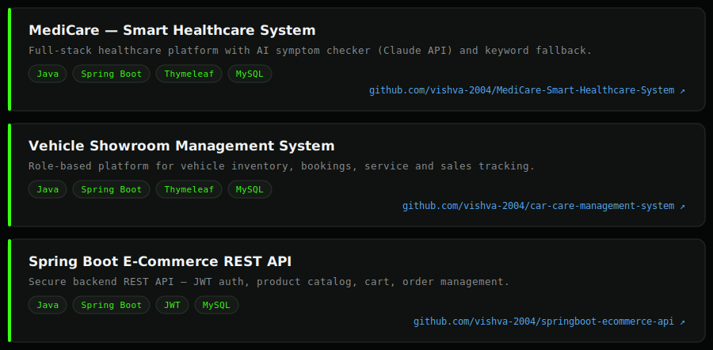

 

 

## About Me

 

## Connect with Me

 

## Tech Stack

**Frontend**

**Backend**

**Database**

**Frameworks**

**Tools**

**Deployment**

 

## Language and Tools

 

## GitHub Stats

 

  

 

## Featured Projects

[MediCare — Smart Healthcare System](https://github.com/vishva-2004/MediCare-Smart-Healthcare-System) &nbsp;·&nbsp;
[Vehicle Showroom Management System](https://github.com/vishva-2004/car-care-management-system) &nbsp;·&nbsp;
[Spring Boot E-Commerce REST API](https://github.com/vishva-2004/springboot-ecommerce-api)

 

