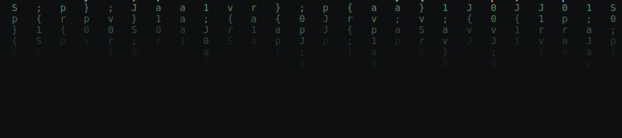

### `01` who am I

I'm a Java Full Stack Developer who enjoys building real projects and learning
new things every day. I like creating clean, useful web applications and solving
problems with code.

- 🎓 Pursuing M.Sc Information Technology, Chennai
- 💼 Java Full Stack training at Uniq Technologies (360 hrs)
- 🌱 Currently exploring AI-integrated backend systems (Claude API)
- 📫 Reach me: vishva.r004@gmail.com

 

### `02` tech stack

 

### `03` github stats

 

### `04` featured projects

 

 

### `05` connect

 

